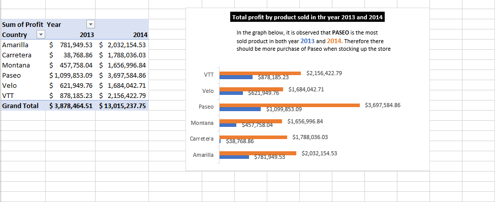
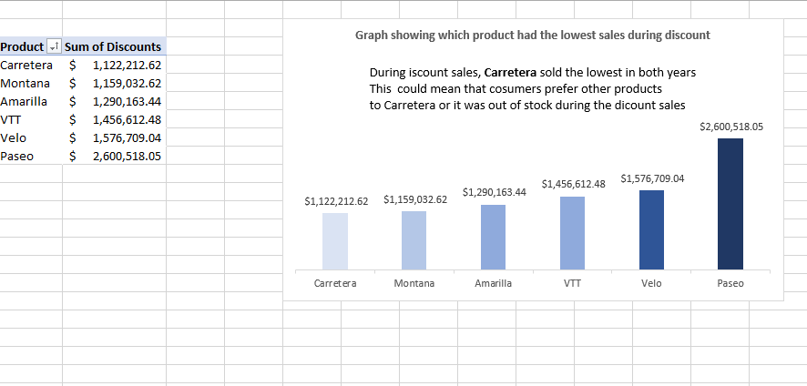
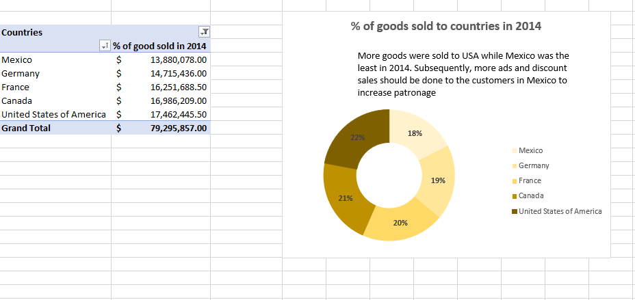
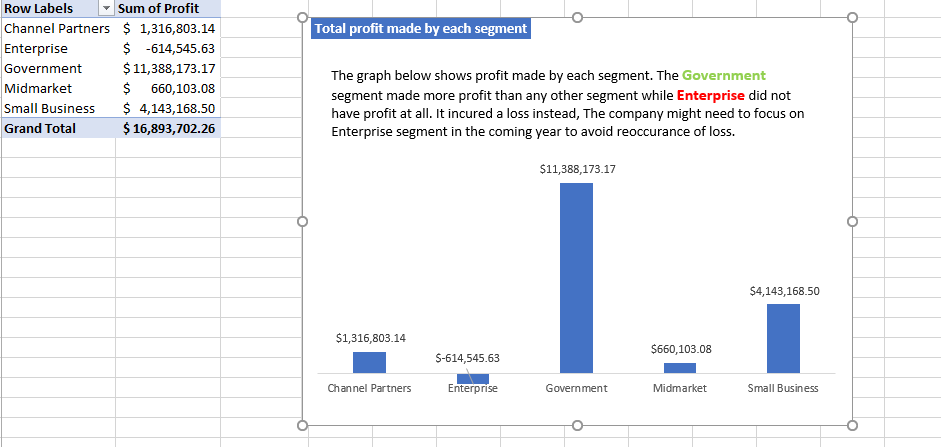
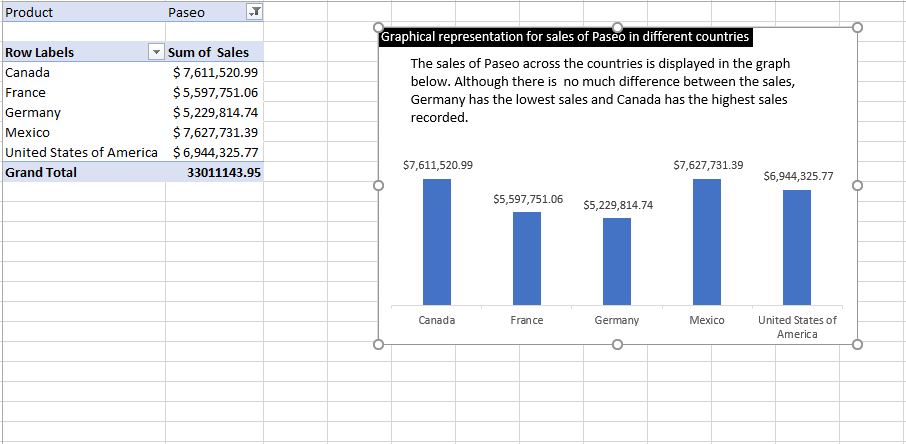

# Microsoft-Excel-project-on-sales

## Introduction
The project is a representation of sales activities in a store "US superstores" during 2013 and 2014.The business was involved with different countries (United States of America, Mexico, Canada, France and Germany) with sales of VTT, Paseo, Amarilla, Carretera, velo and motana. The data was gotten from an excel worksheet which was analysed using pivot tables and graphs to give solution to the problem statements below and recommendations were given.

## Problem Statement
1. What is the total product sold in both years?
2. Which product sld the lowest during discount sales?
3. What percentage of goods were sold to different countries in 2014?
4. What is the total profit made by each segment?
5. What is the sales of paseo in different countries?
6. Calculate the contrbution margin

## Solutions
1. 

2. 

3. 

4. 

5. 

6. 

## Recommendations
From the analysis, it has been discovered that Paseo is the highest sold product in the business and there is more patronage in the US and least sales is to Mexico. It is avised that more ads and discount sales should be done in mexico to encourage cutomers and also ensure tha the suply of Paseo never runs out.

   
